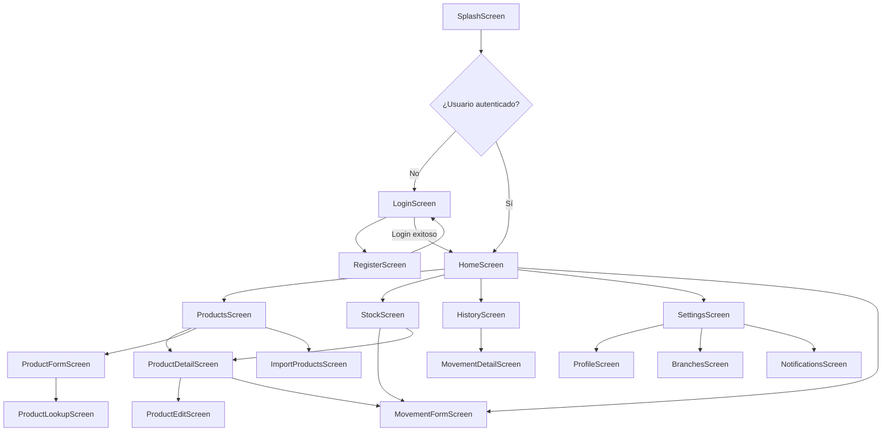

# Navigation Map - Sistema de Gestión de Inventario Multiusuario

## 1. Propósito del documento

Este documento define el mapa de navegación de la aplicación móvil Flutter.

Su objetivo es establecer las pantallas principales, rutas, flujos de navegación, restricciones por autenticación y comportamiento esperado entre módulos.

Este documento se basa en:

```text
docs/architecture/project-scope.md
docs/architecture/technical-decisions.md
docs/architecture/data-model.md
docs/architecture/system-architecture.md
```

---

## 2. Principios de navegación

La navegación debe ser clara, predecible y fácil de explicar durante revisiones técnicas.

Principios:

- Las rutas deben estar centralizadas.
- Las pantallas públicas deben estar separadas de las pantallas privadas.
- El usuario no autenticado no debe acceder a pantallas internas.
- Las pantallas principales deben estar disponibles desde navegación inferior.
- Las pantallas secundarias deben abrirse desde acciones específicas.
- La UI no debe usar strings de rutas dispersos en diferentes archivos.
- La navegación debe respetar roles cuando aplique.

---

## 3. Herramienta de navegación

La aplicación usará una solución de navegación declarativa compatible con Flutter.

Opción recomendada:

```text
go_router
```

### Justificación

`go_router` permite:

- Definir rutas centralizadas.
- Manejar redirecciones.
- Proteger rutas según autenticación.
- Separar flujos públicos y privados.
- Mantener navegación declarativa y mantenible.

---

## 4. Tipos de navegación

La aplicación tendrá tres grupos de navegación:

```text
1. Flujo público
2. Flujo privado principal
3. Flujos secundarios
```

---

## 5. Flujo público

El flujo público incluye pantallas accesibles sin sesión.

Pantallas:

```text
SplashScreen
LoginScreen
RegisterScreen
```

### Rutas

| Pantalla | Ruta | Propósito |
|---|---|---|
| SplashScreen | `/splash` | Validar estado inicial de la app. |
| LoginScreen | `/login` | Permitir inicio de sesión. |
| RegisterScreen | `/register` | Permitir registro de usuario. |

---

## 6. Flujo privado principal

El flujo privado incluye pantallas que requieren autenticación.

Pantallas principales:

```text
HomeScreen
ProductsScreen
StockScreen
MovementsScreen
HistoryScreen
SettingsScreen
```

Estas pantallas pueden formar parte de la navegación inferior.

### Rutas

| Pantalla | Ruta | Propósito |
|---|---|---|
| HomeScreen | `/home` | Resumen general de inventario. |
| ProductsScreen | `/products` | Listado y búsqueda de productos. |
| StockScreen | `/stock` | Visualización de existencias por sucursal. |
| MovementsScreen | `/movements` | Acceso rápido a registro de movimientos. |
| HistoryScreen | `/history` | Historial de movimientos. |
| SettingsScreen | `/settings` | Perfil, sesión y preferencias. |

---

## 7. Navegación inferior

La app tendrá una navegación inferior para las secciones principales.

Tabs recomendados:

```text
Inicio
Productos
Stock
Historial
```

### Justificación

Estos módulos representan el flujo principal del sistema:

- Inicio: resumen.
- Productos: catálogo.
- Stock: existencias.
- Historial: trazabilidad.

El registro de movimiento puede estar disponible como acción destacada desde `Home`, `Stock` o `Products`, en lugar de ocupar necesariamente un tab propio.

### Propuesta de Bottom Navigation

| Tab | Ruta | Icono sugerido | Propósito |
|---|---|---|---|
| Inicio | `/home` | dashboard | Resumen y alertas. |
| Productos | `/products` | inventory_2 | Gestión de productos. |
| Stock | `/stock` | store | Existencias por sucursal. |
| Historial | `/history` | history | Movimientos registrados. |

---

## 8. Pantallas secundarias

Las pantallas secundarias se abren desde acciones dentro de las pantallas principales.

| Pantalla | Ruta | Acceso desde | Propósito |
|---|---|---|---|
| ProductDetailScreen | `/products/:productId` | ProductsScreen | Ver detalle de producto. |
| ProductFormScreen | `/products/new` | ProductsScreen | Crear producto. |
| ProductEditScreen | `/products/:productId/edit` | ProductDetailScreen | Editar producto. |
| ProductLookupScreen | `/products/lookup` | ProductFormScreen | Buscar producto en API externa. |
| ImportProductsScreen | `/products/import` | ProductsScreen | Importar productos desde CSV. |
| BranchesScreen | `/branches` | Settings/Home | Gestionar sucursales de forma básica. |
| MovementFormScreen | `/movements/new` | Home/Stock/ProductDetail | Registrar entrada o salida. |
| MovementDetailScreen | `/history/:movementId` | HistoryScreen | Ver detalle de movimiento. |
| NotificationsScreen | `/notifications` | Home/Settings | Ver alertas o notificaciones. |
| ProfileScreen | `/profile` | SettingsScreen | Ver perfil de usuario. |

---

## 9. Mapa general de rutas

```text
/splash
/login
/register

/home
/products
/products/new
/products/lookup
/products/import
/products/:productId
/products/:productId/edit

/stock
/movements/new

/history
/history/:movementId

/branches
/notifications
/settings
/profile
```

---

## 10. Diagrama de navegación general



---

## 11. Flujo de autenticación

### 11.1 Inicio de app

```text
App inicia
→ SplashScreen
→ Verificar sesión Firebase Auth
→ Si hay sesión: /home
→ Si no hay sesión: /login
```

### 11.2 Login exitoso

```text
LoginScreen
→ AuthViewModel.login()
→ Firebase Auth
→ Obtener User profile en Firestore
→ /home
```

### 11.3 Logout

```text
SettingsScreen
→ Logout
→ Firebase Auth signOut
→ limpiar preferencias locales necesarias
→ /login
```

---

## 12. Protección de rutas

Las rutas privadas requieren usuario autenticado.

Rutas privadas:

```text
/home
/products
/stock
/movements/new
/history
/branches
/notifications
/settings
/profile
```

Regla:

```text
Si no hay usuario autenticado, redirigir a /login.
```

Rutas públicas:

```text
/splash
/login
/register
```

Regla:

```text
Si el usuario ya está autenticado, redirigir a /home.
```

---

## 13. Restricciones por rol

El MVP tendrá dos roles:

```text
admin
collaborator
```

### Admin

Puede acceder a:

```text
/home
/products
/products/new
/products/import
/products/:productId
/products/:productId/edit
/stock
/movements/new
/history
/history/:movementId
/branches
/notifications
/settings
/profile
```

### Collaborator

Puede acceder a:

```text
/home
/products
/products/:productId
/stock
/movements/new
/history
/history/:movementId
/notifications
/settings
/profile
```

Restricciones sugeridas:

- `collaborator` no debería acceder a `/branches` si implica administración.
- `collaborator` no debería importar productos desde CSV salvo decisión explícita del equipo.
- `collaborator` no debería editar productos críticos si el equipo decide limitar esa acción.

---

## 14. Pantallas detalladas

## 14.1 SplashScreen

### Ruta

```text
/splash
```

### Propósito

Validar el estado inicial de la app.

### Comportamiento

- Mostrar logo o loader.
- Inicializar Firebase.
- Revisar sesión.
- Redirigir a `/home` o `/login`.

---

## 14.2 LoginScreen

### Ruta

```text
/login
```

### Propósito

Permitir inicio de sesión.

### Acciones

- Ingresar email.
- Ingresar contraseña.
- Iniciar sesión.
- Navegar a registro.

### Estados

- Loading mientras autentica.
- Error si credenciales son inválidas.
- Success redirige a `/home`.

---

## 14.3 RegisterScreen

### Ruta

```text
/register
```

### Propósito

Permitir registro de usuario.

### Acciones

- Ingresar nombre.
- Ingresar email.
- Ingresar contraseña.
- Crear cuenta.
- Volver a login.

### Nota

El rol inicial puede definirse como `collaborator` por defecto o asignarse manualmente en Firestore para el MVP.

---

## 14.4 HomeScreen

### Ruta

```text
/home
```

### Propósito

Mostrar resumen general de inventario.

### Puede mostrar

- Sucursal seleccionada.
- Productos bajo stock.
- Total de productos activos.
- Últimos movimientos.
- Acceso rápido a registrar movimiento.
- Acceso rápido a crear producto.

---

## 14.5 ProductsScreen

### Ruta

```text
/products
```

### Propósito

Listar, buscar y filtrar productos.

### Acciones

- Buscar productos.
- Filtrar por categoría.
- Ver detalle.
- Crear producto.
- Importar CSV, si aplica.
- Ver productos activos/inactivos según rol.

---

## 14.6 ProductFormScreen

### Ruta

```text
/products/new
```

### Propósito

Crear producto manualmente.

### Acciones

- Ingresar datos.
- Asociar imagen.
- Buscar por API externa.
- Guardar producto.

### Validaciones

- Nombre obligatorio.
- SKU obligatorio.
- Categoría obligatoria.
- Stock mínimo mayor o igual a cero.
- SKU no duplicado.

---

## 14.7 ProductLookupScreen

### Ruta

```text
/products/lookup
```

### Propósito

Buscar producto usando API externa.

### Acciones

- Ingresar código de barras.
- Consultar API externa.
- Ver datos sugeridos.
- Aplicar sugerencias al formulario.

### Nota

Puede implementarse como pantalla separada o como sección dentro de `ProductFormScreen`.

---

## 14.8 ImportProductsScreen

### Ruta

```text
/products/import
```

### Propósito

Importar productos desde archivo CSV.

### Acciones

- Seleccionar archivo.
- Ver vista previa.
- Ver errores.
- Confirmar importación.

### Nota

Esta funcionalidad es complementaria para el MVP.

---

## 14.9 ProductDetailScreen

### Ruta

```text
/products/:productId
```

### Propósito

Mostrar detalle de producto.

### Puede mostrar

- Imagen.
- Nombre.
- SKU.
- Código de barras.
- Categoría.
- Descripción.
- Stock mínimo.
- Estado.
- Stock por sucursal.
- Últimos movimientos del producto.

### Acciones

- Editar producto.
- Registrar entrada o salida.
- Desactivar producto.

---

## 14.10 ProductEditScreen

### Ruta

```text
/products/:productId/edit
```

### Propósito

Editar datos de producto.

### Restricción

No debe editar stock directamente.

---

## 14.11 StockScreen

### Ruta

```text
/stock
```

### Propósito

Mostrar existencias disponibles por sucursal.

### Acciones

- Seleccionar sucursal.
- Filtrar por categoría.
- Ver productos bajo stock.
- Abrir detalle de producto.
- Registrar movimiento.

---

## 14.12 MovementFormScreen

### Ruta

```text
/movements/new
```

### Propósito

Registrar entrada o salida de inventario.

### Campos

- Producto.
- Sucursal.
- Tipo de movimiento.
- Cantidad.
- Motivo.
- Notas.

### Validaciones

- Producto obligatorio.
- Sucursal obligatoria.
- Cantidad mayor a cero.
- Motivo obligatorio.
- En salidas, validar stock suficiente.

---

## 14.13 HistoryScreen

### Ruta

```text
/history
```

### Propósito

Mostrar historial de movimientos.

### Filtros

- Producto.
- Sucursal.
- Tipo.
- Fecha.
- Usuario.

### Acciones

- Ver detalle de movimiento.

---

## 14.14 MovementDetailScreen

### Ruta

```text
/history/:movementId
```

### Propósito

Mostrar detalle de un movimiento.

### Puede mostrar

- Producto.
- Sucursal.
- Usuario responsable.
- Tipo.
- Cantidad.
- Stock anterior.
- Stock resultante.
- Motivo.
- Fecha.

---

## 14.15 BranchesScreen

### Ruta

```text
/branches
```

### Propósito

Gestionar sucursales de forma básica.

### Acciones

- Listar sucursales.
- Crear sucursal, si el MVP lo incluye.
- Editar sucursal, si el MVP lo incluye.
- Desactivar sucursal, si el MVP lo incluye.

### Nota

La sucursal es obligatoria en el modelo, pero el módulo de administración de sucursales debe mantenerse ligero.

---

## 14.16 NotificationsScreen

### Ruta

```text
/notifications
```

### Propósito

Mostrar alertas o notificaciones relacionadas con inventario.

### Puede mostrar

- Productos bajo stock.
- Alertas recientes.
- Estado de permisos de notificación.
- Token FCM registrado, solo para depuración si aplica.

---

## 14.17 SettingsScreen

### Ruta

```text
/settings
```

### Propósito

Mostrar configuración de la app.

### Acciones

- Ver perfil.
- Cambiar tema o preferencias.
- Ver sucursal seleccionada.
- Cerrar sesión.

---

## 14.18 ProfileScreen

### Ruta

```text
/profile
```

### Propósito

Mostrar datos del usuario actual.

### Puede mostrar

- Nombre.
- Email.
- Rol.
- Sucursales asignadas.

---

## 15. Navegación por módulo

### Auth

```text
/splash
/login
/register
```

### Products

```text
/products
/products/new
/products/lookup
/products/import
/products/:productId
/products/:productId/edit
```

### Stock

```text
/stock
```

### Movements

```text
/movements/new
/history
/history/:movementId
```

### Branches

```text
/branches
```

### Notifications

```text
/notifications
```

### Settings

```text
/settings
/profile
```

---

## 16. Navegación y estados vacíos

La navegación debe contemplar estados vacíos.

Ejemplos:

- Sin productos:
  - Mostrar empty state con acción “Crear producto”.
- Sin movimientos:
  - Mostrar empty state con explicación.
- Sin stock en sucursal:
  - Mostrar empty state con acción sugerida.
- API externa sin resultado:
  - Permitir registro manual.
- Archivo CSV sin filas válidas:
  - Mostrar errores y bloquear importación.

---

## 17. Navegación y errores

Errores esperados:

- Usuario no autenticado.
- Permiso insuficiente.
- Producto no encontrado.
- Movimiento no encontrado.
- API externa no disponible.
- Stock insuficiente.
- Archivo CSV inválido.
- Error al subir imagen.

Comportamiento esperado:

- Mostrar mensaje claro.
- Permitir reintento si aplica.
- Evitar dejar al usuario en una pantalla rota.
- Mantener navegación estable.

---

## 18. Criterios de aceptación del mapa de navegación

El mapa de navegación se considera correcto si:

- Hay separación entre rutas públicas y privadas.
- Las rutas privadas requieren autenticación.
- Las rutas principales son accesibles desde navegación inferior.
- Las pantallas secundarias tienen rutas claras.
- El registro de productos soporta flujo manual y asistido.
- El registro de movimientos es accesible desde puntos relevantes.
- El historial permite llegar al detalle del movimiento.
- Los roles pueden restringir pantallas sensibles.
- No hay rutas duplicadas o ambiguas.
- La navegación se puede explicar durante revisiones técnicas.

---

## 19. Estado del documento

Este documento debe actualizarse si cambian:

- Las pantallas del sistema.
- Las rutas principales.
- El uso de bottom navigation.
- Las restricciones por rol.
- El flujo de autenticación.
- El flujo de productos.
- El flujo de movimientos.
- El flujo de importación CSV.

