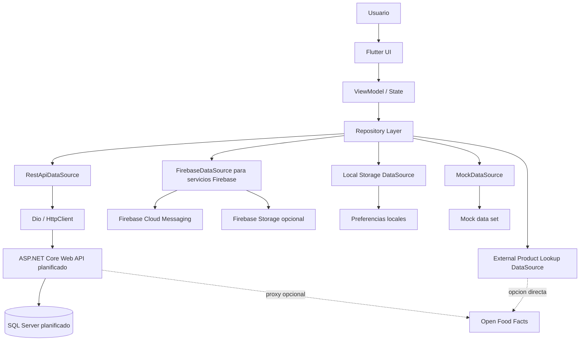
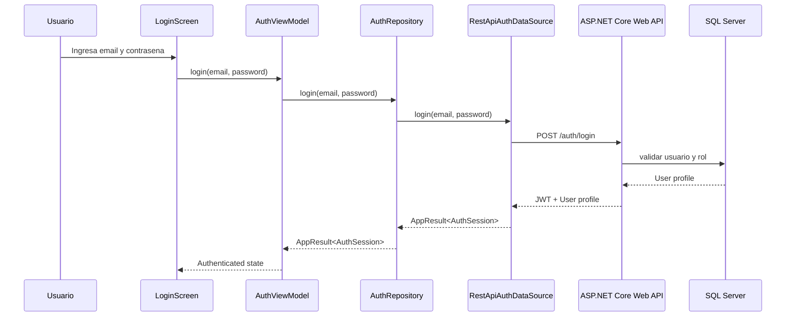
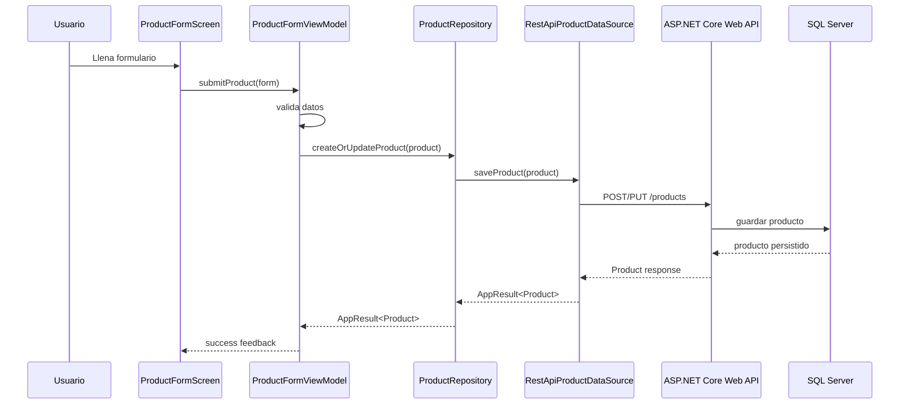
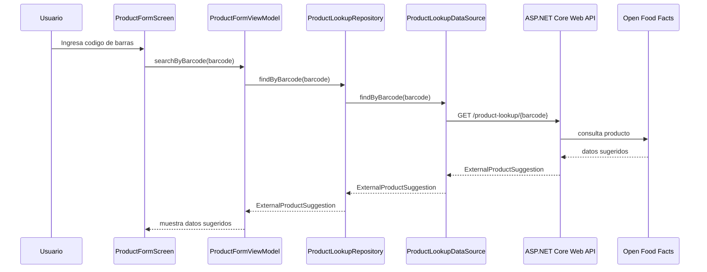
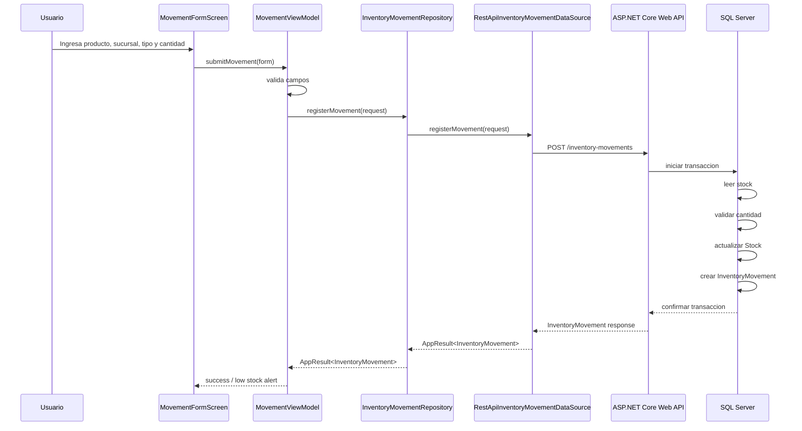
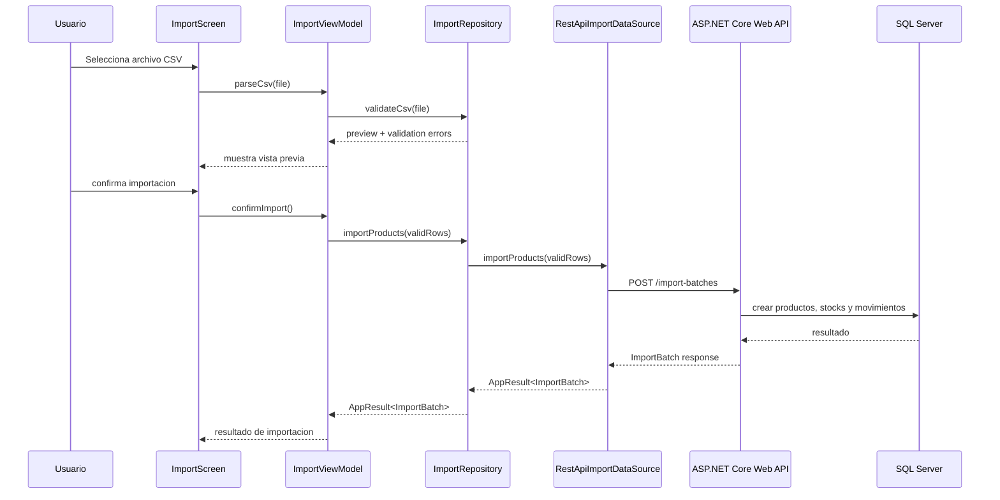
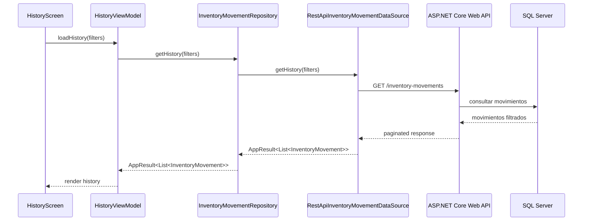
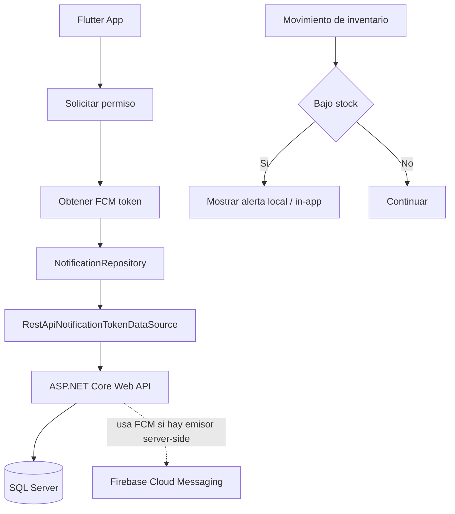

# System Architecture - Sistema de Gestion de Inventario Multiusuario

## 1. Proposito del documento

Este documento describe la arquitectura general del sistema de gestion de inventario multiusuario desarrollado con Flutter.

Su objetivo es explicar como se organizan los componentes principales, como se comunican las capas internas, como se integra el backend planificado y como se mantienen aisladas las fuentes externas de datos.

Este documento se basa en:

```text
docs/architecture/project-scope.md
docs/architecture/technical-decisions.md
docs/architecture/data-model.md
docs/api-contracts/openapi.inventory-api.yaml
docs/api-contracts/external-product-api.md
```

`docs/api-contracts/firestore-collections.md` documenta un enfoque anterior basado en Firestore. Ya no es el contrato activo de persistencia y queda pendiente de reemplazo por documentacion de esquema SQL Server.

---

## 2. Vision general del sistema

El sistema sera una aplicacion movil Flutter orientada a la gestion de inventario en una pequena cadena de tiendas locales.

La aplicacion permitira:

- Autenticacion de usuarios.
- Gestion de productos.
- Gestion simple de sucursales.
- Consulta de stock por sucursal.
- Registro de entradas y salidas de inventario.
- Historial de movimientos.
- Busqueda y filtros.
- Manejo de imagenes de productos.
- Alertas y notificaciones relacionadas con bajo stock.
- Consumo de API externa para autocompletar productos.
- Almacenamiento local limitado para preferencias.

La direccion de arquitectura planificada es:

```text
Flutter
→ Dio / HttpClient
→ ASP.NET Core Web API
→ SQL Server
```

El backend ASP.NET Core Web API expondra endpoints REST consumidos por Flutter mediante Dio / HttpClient. SQL Server sera la capa principal de persistencia detras del backend. Docker / Docker Compose dara soporte a la infraestructura backend, especialmente para SQL Server en desarrollo local.

El backend, la configuracion Docker y SQL Server todavia estan pendientes. Este documento describe la arquitectura objetivo sin asumir que esos componentes ya existen.

Firebase no sera el backend principal ni la base de datos principal. Se mantiene para:

- Firebase Cloud Messaging para notificaciones push.
- Firebase Storage como opcion para imagenes de productos, pendiente de decision final.

El contrato REST principal vive en:

```text
docs/api-contracts/openapi.inventory-api.yaml
```

Los datos de demostracion descritos en `docs/api-contracts/mock-data.md` se utilizan en desarrollo, pruebas y demos, y permiten alimentar implementaciones mock de los data sources.

La UI y los ViewModels no deben depender directamente del backend, SQL Server, Firebase, un cliente REST ni cualquier otra fuente concreta de datos.

---

## 3. Diagrama general de arquitectura



El flujo principal de datos del MVP sera `RestApiDataSource → ASP.NET Core Web API → SQL Server`. `MockDataSource` se mantiene para pruebas, demos y trabajo temprano de UI. `FirebaseDataSource` solo debe aplicarse a servicios Firebase, como FCM u opcion de Storage, no a persistencia de inventario.

---

## 4. Principio arquitectonico principal

El principio central sera:

```text
La UI no debe conocer detalles del backend, SQL Server, Firebase, Storage, FCM, almacenamiento local ni APIs externas.
```

La comunicacion principal debe pasar por capas:

```text
UI
→ ViewModel
→ Repository
→ RestApiDataSource
→ ASP.NET Core Web API
→ SQL Server
```

Esto permite mantener separacion de responsabilidades, mejorar la mantenibilidad y facilitar pruebas.

---

## 5. Arquitectura interna

La aplicacion usara una arquitectura basada en:

```text
MVVM
Repository Pattern
Layer-first structure
Riverpod
REST API backend planificado
```

Flujo interno:

```text
Screen / Widget
→ ViewModel
→ Repository
→ Data Source
→ External service
```

---

## 5A. Backend-swappable data sources

La aplicacion se disena para ser independiente del proveedor concreto de backend.

Los contratos de repositorio definidos en `domain/repositories/` son la frontera estable. Detras de cada repositorio puede vivir mas de una implementacion de data source, sin que la UI ni los ViewModels deban cambiar.

Implementaciones previstas:

- `RestApiDataSource` — familia principal de data sources para datos del MVP. Consume el backend ASP.NET Core Web API mediante Dio.
- `MockDataSource` — implementacion en memoria alineada con `docs/api-contracts/mock-data.md`. Soporta pruebas unitarias, widget tests, desarrollo temprano de UI y demos.
- `FirebaseDataSource` — implementacion limitada a servicios Firebase, como FCM y Storage opcional. No debe usarse para persistencia de inventario.

Reglas:

- Los repositorios son agnosticos del backend.
- La UI y los ViewModels nunca dependen de un proveedor concreto de datos.
- El intercambio de data source ocurre en la composicion de dependencias con Riverpod, no dentro de las pantallas.
- `RestApiDataSource` es el camino principal para datos de aplicacion del MVP.

---

## 6. Estructura de carpetas propuesta

Dentro de `app/lib`, la estructura base sera:

```text
lib/
├── app/
│   ├── app.dart
│   ├── bootstrap.dart
│   └── theme.dart
│
├── core/
│   ├── constants/
│   ├── errors/
│   ├── result/
│   ├── storage/
│   ├── validation/
│   ├── utils/
│   └── widgets/
│
├── data/
│   ├── datasources/
│   │   ├── rest/
│   │   ├── mock/
│   │   ├── external/
│   │   ├── firebase/
│   │   └── local/
│   ├── dto/
│   ├── mappers/
│   └── repositories/
│
├── domain/
│   ├── models/
│   ├── repositories/
│   └── usecases/
│
├── navigation/
│   ├── app_router.dart
│   └── routes.dart
│
├── notifications/
│   ├── notification_service.dart
│   └── fcm_service.dart
│
└── ui/
    ├── auth/
    ├── branches/
    ├── products/
    ├── stock/
    ├── movements/
    ├── history/
    ├── import/
    ├── notifications/
    └── settings/
```

Enfasis de data sources:

- `data/datasources/rest/` sera el camino principal para datos de aplicacion.
- `data/datasources/mock/` se mantiene para pruebas y demos.
- `data/datasources/external/` se mantiene para Open Food Facts si se consume directamente desde Flutter.
- `data/datasources/firebase/` solo debe cubrir servicios Firebase, como FCM o Storage opcional, no persistencia de inventario.

---

## 7. Responsabilidades por capa

## 7.1 App

La carpeta `app/` contiene la configuracion inicial de la aplicacion.

Responsabilidades:

- Inicializar servicios requeridos.
- Inicializar providers globales.
- Configurar tema visual.
- Configurar router principal.
- Exponer el widget raiz de la app.

---

## 7.2 Core

La carpeta `core/` contiene utilidades compartidas y elementos reutilizables.

Responsabilidades:

- Manejo de errores comunes.
- Resultado estandar de operaciones.
- Validaciones reutilizables.
- Widgets compartidos.
- Constantes.
- Helpers.
- Almacenamiento local simple.

---

## 7.3 Domain

La carpeta `domain/` contiene modelos y contratos independientes de infraestructura externa.

Responsabilidades:

- Definir entidades del sistema.
- Definir contratos de repositorios.
- Definir reglas o casos de uso cuando sea necesario.

Regla:

```text
domain/ no debe importar Firebase, Firestore, Dio, Storage ni paquetes de UI.
```

---

## 7.4 Data

La carpeta `data/` contiene implementaciones concretas de acceso a datos.

Responsabilidades:

- Implementar repositorios.
- Consumir el backend ASP.NET Core Web API mediante Dio.
- Consumir API externa si aplica.
- Integrarse con servicios Firebase especificos.
- Leer almacenamiento local.
- Mapear datos remotos a modelos de dominio.
- Manejar errores tecnicos.

Ejemplos:

```text
RestApiAuthDataSource
RestApiProductDataSource
RestApiStockDataSource
RestApiInventoryMovementDataSource
RestApiNotificationTokenDataSource
OpenFoodFactsDataSource
FirebaseMessagingDataSource
FirebaseStorageDataSource
LocalPreferencesDataSource
MockProductDataSource
MockInventoryMovementDataSource
ProductRepositoryImpl
StockRepositoryImpl
```

Los `RestApi*DataSource` consumen el contrato definido en `docs/api-contracts/openapi.inventory-api.yaml`. Los `Mock*DataSource` se alimentan de `docs/api-contracts/mock-data.md` y se utilizan en pruebas y demos.

---

## 7.5 UI

La carpeta `ui/` contiene pantallas, componentes especificos de pantalla y ViewModels.

Responsabilidades:

- Renderizar interfaz.
- Capturar acciones del usuario.
- Mostrar estados de carga, vacio, exito y error.
- Delegar acciones al ViewModel.
- No acceder directamente al backend, SQL Server, Firebase ni APIs externas.

---

## 7.6 Navigation

La carpeta `navigation/` centraliza rutas y navegacion.

Responsabilidades:

- Definir rutas.
- Proteger rutas privadas.
- Redirigir segun estado de autenticacion.
- Separar flujo publico y privado.

---

## 7.7 Notifications

La carpeta `notifications/` contiene servicios relacionados con FCM y notificaciones locales.

Responsabilidades:

- Solicitar permisos de notificacion.
- Obtener token FCM.
- Enviar token al backend mediante Dio.
- Manejar mensajes recibidos.
- Mostrar notificaciones locales o alertas de bajo stock.

---

## 8. Flujo de autenticacion



### Regla

La UI no debe llamar directamente al backend ni manejar validacion de JWT. La autenticacion pasa por `AuthRepository` y `RestApiAuthDataSource`.

---

## 9. Flujo de creacion o actualizacion de producto



---

## 10. Flujo de creacion asistida por API externa



El backend puede actuar como proxy de Open Food Facts. Si se decide consumo directo desde Flutter, `OpenFoodFactsDataSource` sera una opcion de implementacion, no el camino de persistencia de inventario.

---

## 11. Flujo de registro de movimiento



### Reglas

- Una entrada aumenta stock.
- Una salida disminuye stock.
- Una salida no puede superar el stock disponible.
- Todo movimiento debe quedar en historial.
- El stock no se edita directamente.
- La consistencia debe resolverse con transaccion en el backend.

---

## 12. Flujo de importacion CSV



### Regla

La importacion es complementaria. El registro manual sigue siendo obligatorio.

---

## 13. Flujo de historial



---

## 14. Flujo de notificaciones



### Decision MVP

Para el MVP:

- Flutter obtiene el token FCM.
- Flutter envia el token al backend mediante Dio.
- El backend almacena el token en SQL Server cuando se implemente.
- Flutter puede recibir push mediante Firebase Messaging.
- Se puede mostrar alerta local o in-app por bajo stock.

### Mejora futura

- Envio server-side de push automatica por bajo stock desde el backend u otro servicio compatible.

---

## 15. Integracion con Firebase

Firebase se mantiene para servicios especificos. No sera el backend principal ni la persistencia principal del inventario.

## 15.1 Firebase Cloud Messaging

Uso:

- Obtener token del dispositivo.
- Recibir push.
- Preparar infraestructura para notificaciones futuras.

El token FCM se enviara al backend mediante Dio para que pueda almacenarse en SQL Server cuando se implemente el endpoint correspondiente.

---

## 15.2 Firebase Storage opcional

Uso posible:

- Guardar imagenes de productos.
- Obtener una URL o referencia de imagen.
- Persistir `imageUrl` mediante el backend.

La decision final puede ser Firebase Storage o un flujo gestionado por backend. Firebase Storage no implica persistencia de inventario.

---

## 16. Integracion con API externa

La API externa se usa unicamente para autocompletar productos.

Fuente principal:

```text
Open Food Facts API
```

Contrato documentado en:

```text
docs/api-contracts/external-product-api.md
```

El backend puede enrutar la busqueda mediante el endpoint `GET /product-lookup/{barcode}` definido en `docs/api-contracts/openapi.inventory-api.yaml`. En ese caso, el backend actua como proxy del proveedor externo.

Tambien puede existir consumo directo desde Flutter mediante `OpenFoodFactsDataSource`, si se decide por simplicidad. Esa opcion no reemplaza al backend como camino de persistencia.

Dio se usa para el backend y para integraciones HTTP. Dio nunca se usa para conectar directamente a SQL Server.

---

## 17. Almacenamiento local

El almacenamiento local sera limitado.

Uso previsto:

- Ultima sucursal seleccionada.
- Filtros recientes.
- Preferencia de tema.
- Preferencias simples de usuario.

No se promete modo offline completo.

---

## 18. Manejo de errores

La arquitectura debera manejar errores de forma uniforme.

Ejemplos de errores:

- Error de autenticacion.
- Producto duplicado.
- Stock insuficiente.
- Producto inactivo.
- Sucursal inactiva.
- API externa no disponible.
- Error de red.
- Archivo CSV invalido.
- Error al subir imagen.

Los repositorios deben devolver resultados controlados, por ejemplo:

```text
Success<T>
Failure
```

La UI debe mostrar mensajes claros y permitir reintento cuando aplique.

---

## 19. Estados de UI

Las pantallas deben contemplar estados explicitos:

```text
initial
loading
success
empty
error
```

---

## 20. Testing dentro de la arquitectura

La arquitectura debe facilitar pruebas.

### Unit tests

Para:

- Validadores.
- Reglas de stock.
- Mapeadores.
- Casos de uso.
- Repositorios usando `MockDataSource` u otros fakes en memoria.

### Widget tests

Para:

- Formularios.
- Estados de carga.
- Estados vacios.
- Mensajes de error.
- Componentes reutilizables.

`MockDataSource` resulta util en widget tests y pruebas de ViewModel porque permite controlar respuestas, simular errores como `insufficient_stock` o `product_not_found` y mantener tiempos de ejecucion cortos sin depender de un backend real ni de la red.

Flutter tests deben mockear `RestApiDataSource` o repositorios por defecto. No deben depender de un backend real para pruebas unitarias o widget tests.

### Integration tests

Para:

- Login.
- Crear producto.
- Registrar entrada.
- Registrar salida.
- Validar stock insuficiente.
- Consultar historial.

Las pruebas de integracion backend deberan validar eventualmente endpoints del ASP.NET Core Web API cuando el backend exista.

---

## 21. Integracion continua

GitHub Actions ejecutara validaciones automaticas.

Validaciones minimas:

```text
flutter analyze
flutter test
```

Posibles validaciones adicionales:

```text
flutter format --set-exit-if-changed .
flutter build apk --debug
```

---

## 22. Ventajas de esta arquitectura

Esta arquitectura permite:

- Separar UI de acceso a datos.
- Mantener el backend aislado en data sources.
- Mantener Firebase limitado a servicios especificos.
- Cambiar API externa sin afectar pantallas.
- Probar logica sin depender de servicios reales.
- Escalar modulos sin volver monolitica la app.
- Defender claramente responsabilidades por capa.

---

## 23. Riesgos arquitectonicos

### 23.1 Lógica critica en cliente

Registrar movimientos desde la app sin transaccion backend generaria riesgo de inconsistencias.

Mitigacion:

Centralizar los cambios de stock en el backend con transacciones SQL Server o EF Core.

---

### 23.2 Acoplar UI a infraestructura

Si las pantallas llaman directamente a Dio, Firebase o almacenamiento local, se rompe la arquitectura.

Mitigacion:

Forzar acceso por repositorios y data sources.

---

### 23.3 Crecimiento desordenado

Si cada modulo crea sus propios patrones, la app se vuelve dificil de mantener.

Mitigacion:

Definir estructura comun para ViewModels, estados, repositorios y validaciones.

---

### 23.4 API externa inestable

La API externa puede no responder o no encontrar productos.

Mitigacion:

Mantener registro manual como flujo principal.

---

## 24. Criterio de aceptacion de arquitectura

La arquitectura se considera correcta si:

- La UI no accede directamente al backend, SQL Server, Firebase ni APIs externas.
- Los ViewModels no conocen detalles de Dio, SQL Server, FCM ni Storage.
- Los repositorios encapsulan acceso a datos.
- `RestApiDataSource` es el camino principal para datos de aplicacion.
- `MockDataSource` permite pruebas y demos.
- `FirebaseDataSource` queda limitado a servicios Firebase.
- Las entidades principales estan en dominio.
- La API externa vive en data sources externos o en un proxy backend.
- La navegacion esta centralizada.
- Los errores se manejan de forma uniforme.
- Los estados de UI estan claramente definidos.
- El modelo soporta productos, sucursales, stock y movimientos.
- La estructura permite testing.

---

## 25. Estado del documento

Pendiente de implementacion:

- Scaffold del backend ASP.NET Core Web API.
- Configuracion SQL Server con Docker Compose.
- Endpoints backend segun `docs/api-contracts/openapi.inventory-api.yaml`.
- Conexion de Flutter con `RestApiDataSource` mediante Dio.
- Configuracion FCM.
- Decision final de almacenamiento de imagenes.

Este documento debe actualizarse si cambian:

- La estructura de carpetas.
- El backend principal.
- El enfoque de Firebase.
- La integracion con API externa.
- La estrategia de notificaciones.
- La estrategia de almacenamiento local.
- El patron de arquitectura.
- Las reglas de stock.
