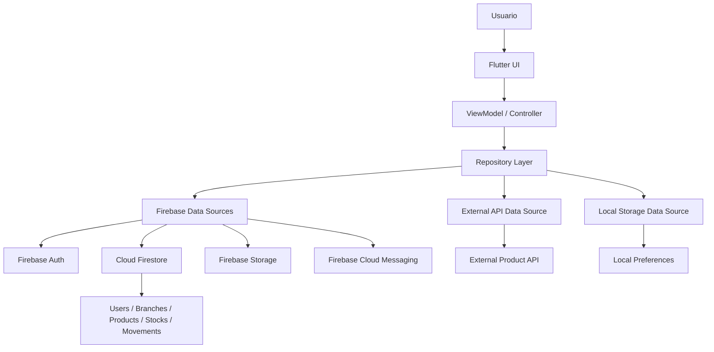
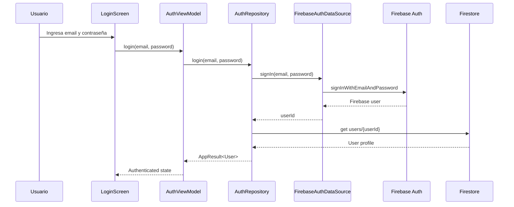
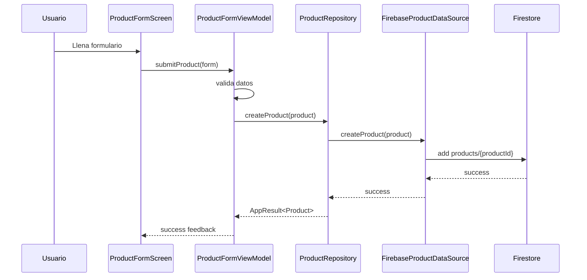
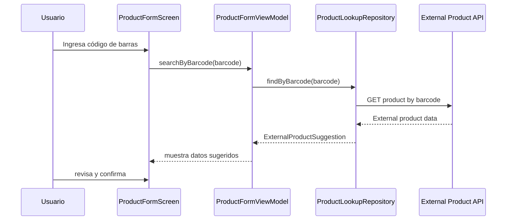
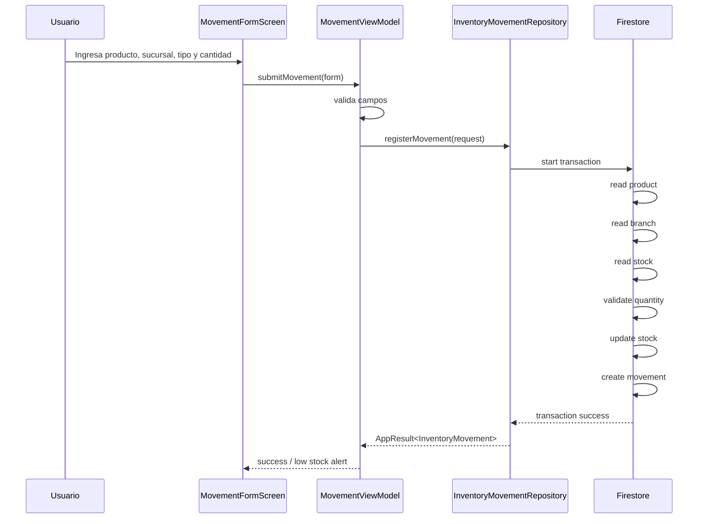
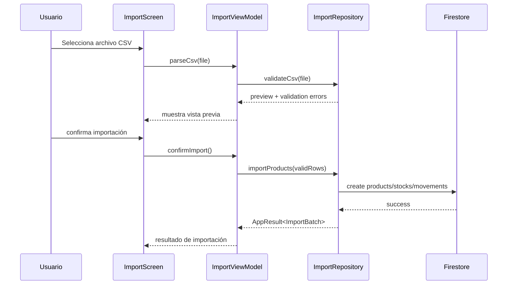
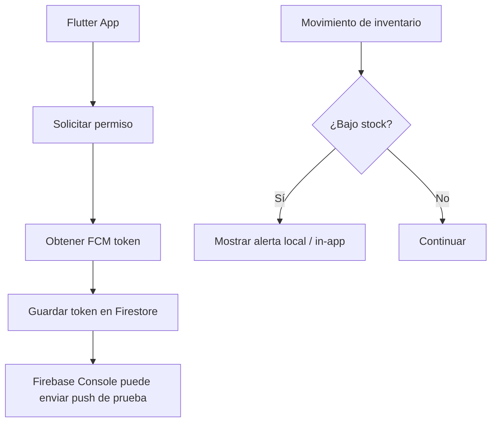

# System Architecture - Sistema de Gestión de Inventario Multiusuario

## 1. Propósito del documento

Este documento describe la arquitectura general del sistema de gestión de inventario multiusuario desarrollado con Flutter.

Su objetivo es explicar cómo se organizan los componentes principales de la aplicación, cómo se comunican las capas internas, cómo se integran Firebase y la API externa, y cómo se mantiene la separación de responsabilidades dentro del proyecto.

Este documento se basa en:

```text
docs/architecture/project-scope.md
docs/architecture/technical-decisions.md
docs/architecture/data-model.md
docs/api-contracts/firestore-collections.md
docs/api-contracts/external-product-api.md
```

---

## 2. Visión general del sistema

El sistema será una aplicación móvil Flutter orientada a la gestión de inventario en una pequeña cadena de tiendas locales.

La aplicación permitirá:

- Autenticación de usuarios.
- Gestión de productos.
- Gestión simple de sucursales.
- Consulta de stock por sucursal.
- Registro de entradas y salidas de inventario.
- Historial de movimientos.
- Búsqueda y filtros.
- Manejo de imágenes de productos.
- Alertas y notificaciones relacionadas con bajo stock.
- Consumo de API externa para autocompletar productos.
- Almacenamiento local limitado para preferencias.

El backend principal será Firebase.

Servicios utilizados:

```text
Firebase Auth
Cloud Firestore
Firebase Storage
Firebase Cloud Messaging
```

La aplicación no usará una API REST propia como backend principal.

---

## 3. Diagrama general de arquitectura



---

## 4. Principio arquitectónico principal

El principio central será:

```text
La UI no debe conocer detalles de Firebase, Firestore, Storage, FCM, almacenamiento local ni APIs externas.
```

La comunicación debe pasar por capas:

```text
UI
→ ViewModel
→ Repository
→ Data Source
→ Firebase / API externa / almacenamiento local
```

Esto permite mantener separación de responsabilidades, mejorar la mantenibilidad y facilitar pruebas.

---

## 5. Arquitectura interna

La aplicación usará una arquitectura basada en:

```text
MVVM
Repository Pattern
Layer-first structure
Riverpod
Firebase-first backend
```

Flujo interno:

```text
Screen / Widget
→ ViewModel
→ Repository
→ Data Source
→ External service
```

---

## 6. Estructura de carpetas propuesta

Dentro de `app/lib`, la estructura base será:

```text
lib/
├── app/
│   ├── app.dart
│   ├── bootstrap.dart
│   └── theme.dart
│
├── core/
│   ├── constants/
│   ├── errors/
│   ├── result/
│   ├── storage/
│   ├── validation/
│   ├── utils/
│   └── widgets/
│
├── data/
│   ├── datasources/
│   │   ├── firebase/
│   │   ├── external/
│   │   └── local/
│   ├── dto/
│   ├── mappers/
│   └── repositories/
│
├── domain/
│   ├── models/
│   ├── repositories/
│   └── usecases/
│
├── navigation/
│   ├── app_router.dart
│   └── routes.dart
│
├── notifications/
│   ├── notification_service.dart
│   └── fcm_service.dart
│
└── ui/
    ├── auth/
    ├── branches/
    ├── products/
    ├── stock/
    ├── movements/
    ├── history/
    ├── import/
    ├── notifications/
    └── settings/
```

---

## 7. Responsabilidades por capa

## 7.1 App

La carpeta `app/` contiene la configuración inicial de la aplicación.

Responsabilidades:

- Inicializar Firebase.
- Inicializar providers globales.
- Configurar tema visual.
- Configurar router principal.
- Exponer el widget raíz de la app.

Ejemplos:

```text
app.dart
bootstrap.dart
theme.dart
```

---

## 7.2 Core

La carpeta `core/` contiene utilidades compartidas y elementos reutilizables.

Responsabilidades:

- Manejo de errores comunes.
- Resultado estándar de operaciones.
- Validaciones reutilizables.
- Widgets compartidos.
- Constantes.
- Helpers.
- Almacenamiento local simple.

Ejemplos:

```text
AppResult
AppException
AuthValidators
ProductValidators
MovementValidators
LoadingState
EmptyState
ErrorState
```

---

## 7.3 Domain

La carpeta `domain/` contiene modelos y contratos independientes de Firebase o cualquier infraestructura externa.

Responsabilidades:

- Definir entidades del sistema.
- Definir contratos de repositorios.
- Definir reglas o casos de uso cuando sea necesario.

Ejemplos de modelos:

```text
User
Branch
Product
Stock
InventoryMovement
NotificationToken
ImportBatch
ExternalProductSuggestion
```

Ejemplos de contratos:

```text
AuthRepository
ProductRepository
StockRepository
InventoryMovementRepository
BranchRepository
ProductLookupRepository
```

Regla:

```text
domain/ no debe importar Firebase, Firestore, Dio, Storage ni paquetes de UI.
```

---

## 7.4 Data

La carpeta `data/` contiene implementaciones concretas de acceso a datos.

Responsabilidades:

- Implementar repositorios.
- Comunicarse con Firebase.
- Consumir API externa.
- Leer almacenamiento local.
- Mapear datos remotos a modelos de dominio.
- Manejar errores técnicos.

Subcarpetas esperadas:

```text
data/datasources/firebase/
data/datasources/external/
data/datasources/local/
data/dto/
data/mappers/
data/repositories/
```

Ejemplos:

```text
FirebaseProductDataSource
FirebaseStockDataSource
FirebaseInventoryMovementDataSource
OpenFoodFactsDataSource
LocalPreferencesDataSource
ProductRepositoryImpl
StockRepositoryImpl
```

---

## 7.5 UI

La carpeta `ui/` contiene pantallas, componentes específicos de pantalla y ViewModels.

Responsabilidades:

- Renderizar interfaz.
- Capturar acciones del usuario.
- Mostrar estados de carga, vacío, éxito y error.
- Delegar acciones al ViewModel.
- No acceder directamente a Firebase ni APIs externas.

Módulos de UI esperados:

```text
ui/auth/
ui/products/
ui/branches/
ui/stock/
ui/movements/
ui/history/
ui/import/
ui/settings/
```

---

## 7.6 Navigation

La carpeta `navigation/` centraliza rutas y navegación.

Responsabilidades:

- Definir rutas.
- Proteger rutas privadas.
- Redirigir según estado de autenticación.
- Separar flujo público y privado.

Ejemplos:

```text
/login
/register
/home
/products
/products/:id
/products/new
/stock
/movements/new
/history
/settings
```

---

## 7.7 Notifications

La carpeta `notifications/` contiene servicios relacionados con FCM y notificaciones locales.

Responsabilidades:

- Solicitar permisos de notificación.
- Obtener token FCM.
- Guardar token en Firestore.
- Manejar mensajes recibidos.
- Mostrar notificaciones locales o alertas de bajo stock.

---

## 8. Flujo de autenticación



### Regla

La UI no debe llamar a Firebase Auth directamente.

---

## 9. Flujo de creación manual de producto



---

## 10. Flujo de creación asistida por API externa



### Regla

Los datos externos son sugerencias. El usuario debe revisar antes de guardar.

---

## 11. Flujo de registro de movimiento



### Reglas

- Una entrada aumenta stock.
- Una salida disminuye stock.
- Una salida no puede superar el stock disponible.
- Todo movimiento debe quedar en historial.
- El stock no se edita directamente.

---

## 12. Flujo de importación CSV



### Regla

La importación es complementaria. El registro manual sigue siendo obligatorio.

---

## 13. Flujo de notificaciones



### Decisión MVP

Para el MVP:

- Se registra el token FCM.
- Se demuestra recepción de push desde Firebase Console.
- Se muestra alerta local o in-app por bajo stock.

### Mejora futura

- Cloud Functions para enviar push automática por bajo stock.

---

## 14. Integración con Firebase

## 14.1 Firebase Auth

Uso:

- Registro.
- Login.
- Logout.
- Persistencia de sesión.
- Identificación del usuario actual.

No se maneja JWT propio.

---

## 14.2 Cloud Firestore

Uso:

- Usuarios.
- Sucursales.
- Productos.
- Stock.
- Movimientos.
- Tokens de notificación.
- Importaciones, si aplica.

Colecciones documentadas en:

```text
docs/api-contracts/firestore-collections.md
```

---

## 14.3 Firebase Storage

Uso:

- Guardar imágenes de productos.
- Obtener `downloadURL`.
- Guardar `imageUrl` en `products`.

Ruta sugerida:

```text
product-images/{productId}/{fileName}
```

---

## 14.4 Firebase Cloud Messaging

Uso:

- Obtener token del dispositivo.
- Guardar token.
- Recibir push de prueba.
- Preparar infraestructura para notificaciones futuras.

---

## 15. Integración con API externa

La API externa se usa únicamente para autocompletar productos.

Fuente principal:

```text
Open Food Facts API
```

Contrato documentado en:

```text
docs/api-contracts/external-product-api.md
```

Dio se usará solo para esta integración.

---

## 16. Almacenamiento local

El almacenamiento local será limitado.

Uso previsto:

- Última sucursal seleccionada.
- Filtros recientes.
- Preferencia de tema.
- Preferencias simples de usuario.

No se promete modo offline completo.

---

## 17. Manejo de errores

La arquitectura deberá manejar errores de forma uniforme.

Ejemplos de errores:

- Error de autenticación.
- Producto duplicado.
- Stock insuficiente.
- Producto inactivo.
- Sucursal inactiva.
- API externa no disponible.
- Error de red.
- Archivo CSV inválido.
- Error al subir imagen.

Los repositorios deben devolver resultados controlados, por ejemplo:

```text
Success<T>
Failure
```

La UI debe mostrar mensajes claros y permitir reintento cuando aplique.

---

## 18. Estados de UI

Las pantallas deben contemplar estados explícitos:

```text
initial
loading
success
empty
error
```

Ejemplos:

- Productos sin registros → empty state.
- Historial sin movimientos → empty state.
- Búsqueda externa en proceso → loading.
- API externa no disponible → error controlado.
- Movimiento registrado → success feedback.

---

## 19. Testing dentro de la arquitectura

La arquitectura debe facilitar pruebas.

### Unit tests

Para:

- Validadores.
- Reglas de stock.
- Mapeadores.
- Casos de uso.
- Repositorios con mocks.

### Widget tests

Para:

- Formularios.
- Estados de carga.
- Estados vacíos.
- Mensajes de error.
- Componentes reutilizables.

### Integration tests

Para:

- Login.
- Crear producto.
- Registrar entrada.
- Registrar salida.
- Validar stock insuficiente.
- Consultar historial.

---

## 20. Integración continua

GitHub Actions ejecutará validaciones automáticas.

Validaciones mínimas:

```text
flutter analyze
flutter test
```

Posibles validaciones adicionales:

```text
flutter format --set-exit-if-changed .
flutter build apk --debug
```

---

## 21. Ventajas de esta arquitectura

Esta arquitectura permite:

- Separar UI de acceso a datos.
- Mantener Firebase aislado en data sources.
- Cambiar API externa sin afectar pantallas.
- Probar lógica sin depender de servicios reales.
- Escalar módulos sin volver monolítica la app.
- Defender claramente responsabilidades por capa.
- Cumplir arquitectura, modularidad, estado, navegación y reutilización.

---

## 22. Riesgos arquitectónicos

### 22.1 Lógica crítica en cliente

Registrar movimientos con transacciones desde la app es aceptable para MVP, pero en producción sería mejor centralizarlo en Cloud Functions.

Mitigación:

Documentar esta limitación y dejar Cloud Functions como mejora futura.

---

### 22.2 Acoplar UI a Firebase

Si las pantallas llaman directamente a Firestore, se rompe la arquitectura.

Mitigación:

Forzar acceso por repositorios y data sources.

---

### 22.3 Crecimiento desordenado

Si cada módulo crea sus propios patrones, la app se vuelve difícil de mantener.

Mitigación:

Definir estructura común para ViewModels, estados, repositorios y validaciones.

---

### 22.4 API externa inestable

La API externa puede no responder o no encontrar productos.

Mitigación:

Mantener registro manual como flujo principal.

---

## 23. Criterio de aceptación de arquitectura

La arquitectura se considera correcta si:

- La UI no accede directamente a Firebase.
- Los ViewModels no conocen detalles de Firestore ni Dio.
- Los repositorios encapsulan acceso a datos.
- Las entidades principales están en dominio.
- Firebase vive en data sources.
- La API externa vive en data sources externos.
- La navegación está centralizada.
- Los errores se manejan de forma uniforme.
- Los estados de UI están claramente definidos.
- El modelo soporta productos, sucursales, stock y movimientos.
- La estructura permite testing.

---

## 24. Estado del documento

Este documento debe actualizarse si cambian:

- La estructura de carpetas.
- El backend principal.
- El enfoque de Firebase.
- La integración con API externa.
- La estrategia de notificaciones.
- La estrategia de almacenamiento local.
- El patrón de arquitectura.
- Las reglas de stock.

